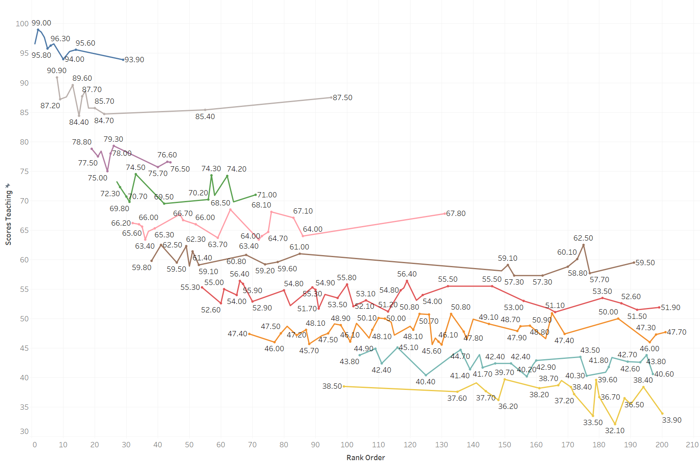
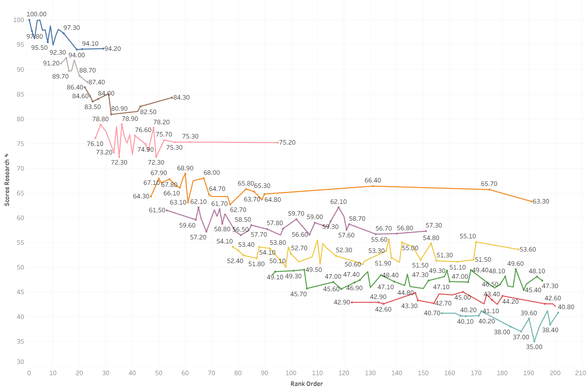
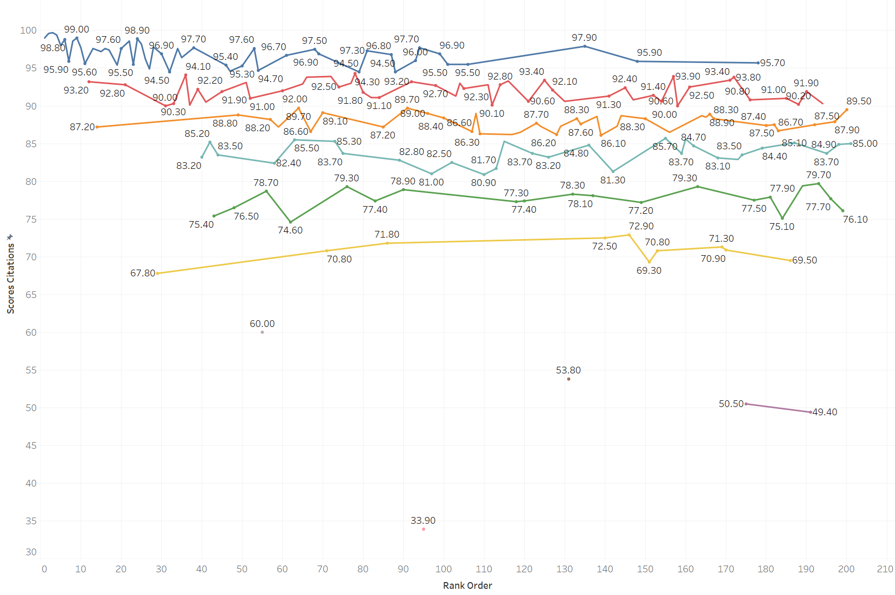

# 数据分析

### 一、散点图

首先我分析了教学（30%）、研究（30%）、引文（30%）、国际展望（7.5%）和行业收入（7.5%）五方面对整体评分等影响。我分别去除了其中的一方面，观察重新加权计算之后的排名是否会有很大变化。计算结果如下：

该图反映了去除教学方面因素后的排名变化。可以看到前50的学校变化不是很大，而之后的学校很多相对y=x向上偏移，即说明许多前200的学校依靠优质的教学提高了它的整体排名。但整体上大多数的数据还是在y=x附近的，教学因素相关系数为0.716（这里不是图上的相关系数，是该因素的相关系数，下同），也说明了其确实可以很好的反映整体的综合评价。

该图反映了去除研究方面因素后的排名变化。可以看到前40的学校变化还是不大，但之后的学校分布开始分散了。存在一些学校排名下降，也存在一些学校排名上升，其中以Lomonosov Moscow  State University（莫斯科国立大学）最为突出，其整体排名为95名，而去除研究方面因素后排名下滑至195名，去除教学方面因素后排名下滑至201名，其他方面的评分相对较低，说明这所学校更重视教学和科研（单项排名为17和46）。在网上调查了这所学校的相关信息，发现这所学校是俄罗斯国内排名第一的学校，有13位诺贝尔奖获得者。我认为这也是其其他方面排名不高（可能也有一些西方世界对俄罗斯的偏见），但是教学和科研成绩一枝独秀的原因吧。相对于教学因素，研究因素相关系数升高至0.875，说明其更好的反映了一所学校的整体实力，这也与我们的认知一致。

该图反映了去除引文方面因素后的排名变化。这里我们可以看到前30的学校大体保持在前列，但后面的学校分布更加分散，有很多学校（包括之前提到的莫斯科国立大学）排名上升幅度明显，大阪大学（Osaka University)甚至上升100多名，也有许多学校排名下降，以下是这些学校的地区分布：

我们可以看到排名下降的学校大多是中国香港，欧洲（尤其是英国）的学校，而下降的多是亚洲学校，有比较强的地域因素。引文因素的相关系数仅有0.345，这也说明并非一定是综合实力更高的学校在引文方面就会更好。

这两张图分别反映了去除国际展望和行业收入后的排名情况。由于在整体评价中这两部分分别只占7.5%和2.5%，说明这两个因素相对于之前的影响因素不是那么的重要，因此整体分布也非常贴近于y=x。而这两者的相关系数也分别只有0.266和0.258，说明综合实力与国际展望和行业收入并无特别大的关联，强校和弱校在这方面也并无太大的不同。我认为这也是THE排名将这两个因素占比设置的很低的原因吧。

综上，我们可以发现，对整体实力影响最大和反映最好的还是教学和研究方向，以下是这两者各占50%后计算出来的排名情况：

这两张图可以比较清晰的让我们看出有哪些学校是被“高估”或是“低估”了。可以看到许多中国香港以及荷兰，澳大利亚等欧洲国家学校其实教学和研究能力并没有其综合排名显示的那么强，而许多中国，日本，韩国，美国的学校都受到其他因素的限制影响了综合排名，地域因素较为明显。但整体来说其相关系数为0.890，这还是可以较好的反映整体的综合实力的。

### 二、聚类折线图

接下来我们将各项得分分为10个聚类具体看看学校的分布情况。

教学和研究方面我们可以看到，整体来说高分区间都由排名靠前的学校占据，低分区间基本也都是排名靠后的学校，但中间的得分学校排名跨度很大。这一点也不难理解，在平均值附近的学校排名自然更依赖于其他方面因素影响。从中我们还是可以发现除了个别突出例子以外，其整体的变化还是符合综合的排名情况的。

引文、国际展望和行业收入三方面我们可以更清晰的看到，大家的得分分布比较均匀，得分高低和综合排名并无很大关系，这也印证了第一部分中我们得到的观点。

这里也引入一些我的思考。是否需要将引文部分设置为30%的占比呢？我们可以很清楚的发现，并非综合实力更强的学校其引用，即科研影响力就会越高，经过我在网上进行查找可知，尽管THE官网上称“我们通过获取全球学者引用一所大学出版物的平均次数来考察研究影响力”，“我们混合了按照国家调整和未按照国家调整的引用分数原始测量方法”，但其结果依旧明显存在地域差异，且这个评分标准还在一直变化也没有公布具体的评分细则。我也在统计2011到2024年的数据过程中发现这个地域差异一直存在，不过也是在逐渐变小的。因此我认为目前的评分尤其是在引文影响力上THE评分并不能做到绝对的公平，依旧是有失偏颇，需要进一步改进的。

### 三、雷达图

这里展示原始数据：

|                | 总体 | 教学 | 研究  | 引文 | 行业收入 | 国际展望 | 前200数量 |
| -------------- | ---- | ---- | ----- | ---- | -------- | -------- | --------- |
| China          | 71.2 | 67.5 | 66.3  | 81.3 | 93.2     | 52.7     | 13        |
| Hong Kong      | 73.2 | 55.3 | 60.5  | 94.5 | 95.7     | 96.2     | 5         |
| United Kingdom | 70.9 | 53.9 | 58.32 | 93.5 | 71.9     | 95.5     | 25        |
| United States  | 75.2 | 66.5 | 66.8  | 91.5 | 84.7     | 71.8     | 56        |
| Japan          | 68.3 | 73.8 | 74.8  | 56.3 | 100      | 53       | 5         |
| South Korea    | 66.1 | 61.9 | 58.7  | 77.7 | 98.9     | 47.5     | 6         |
| Australia      | 68.3 | 46.9 | 57.4  | 90.7 | 93.1     | 91.7     | 11        |

我们可以发现，中国，韩国，日本都在教学和研究上相对突出，但在引文上拉分明显。而行业收入虽然也相对较高但由于占比很低因此影响不是很大，而在国际展望上又是差距明显。亚洲只有中国香港是个特例，在教学和研究上都比较低，但是由于引文和国际展望分数很高使得整体分数还要高于中国，澳大利亚和英国也是大致如此。美国则是整体实力相对都比较均衡，其总体评分也是最高的。从中我们可以看出很明显的地域性差异，也可以发现THE对英国学校还是有“偏爱”的。

### 四、条形折线图

这里展示原始数据：

|      | 总体得分 | 总体排名 | 教学得分 | 教学排名 | 研究得分 | 研究排名 | 引用得分 | 引用排名 | 行业收入得分 | 行业收入排名 | 国际展望得分 | 国际展望排名 |
| ---- | -------- | -------- | -------- | -------- | -------- | -------- | -------- | -------- | ------------ | ------------ | ------------ | ------------ |
| 2018 | 62.3     | 119.9    | 62.2     | 56.3     | 65.4     | 69.1     | 63.1     | 390.4    | 84.4         | 82.1         | 39           | 627.3        |
| 2019 | 65.9     | 96.3     | 69.5     | 43.9     | 65.3     | 65.9     | 66.2     | 395.7    | 78.6         | 130.9        | 48.1         | 548.1        |
| 2020 | 66.6     | 92       | 68.1     | 46.9     | 68.3     | 62.9     | 65.8     | 426.1    | 87.1         | 77.7         | 50.4         | 561.1        |
| 2021 | 69.2     | 72.1     | 69.4     | 42.3     | 71.7     | 53.7     | 68.7     | 419.4    | 90           | 71.3         | 52.3         | 571.6        |
| 2022 | 71.5     | 63.4     | 70.9     | 39       | 73.8     | 48.7     | 73.2     | 391.8    | 88.7         | 81.9         | 52           | 622.1        |
| 2023 | 74       | 53.1     | 74.3     | 32       | 78.7     | 39.1     | 74.1     | 424      | 89.4         | 73.6         | 48.8         | 740.7        |
| 2024 | 80       | 42.6     | 78.9     | 30.1     | 79.5     | 38.9     | 84.5     | 232.7    | 98           | 73.7         | 58.8         | 623.3        |

首先我们统计的是2024年所有进入前200名的中国学校的各项得分和排名变化。从2018年开始统计是因为前面年份中有些学校没有进入前200，而且排名变化的幅度很大，我猜测是由于THE对中国学校的评分标准一直在完善，一直到2018年才逐步稳定下来。我们从数据中可以发现总体的排名是随着时间一直在进步的，教学和研究得分也是提升很快，一部分是因为我国最近大力推动高校建设，投入了很多资金来完善教育和研究设施，另一方面我认为也有THE对评分标准的进一步完善，以及获取到了更多关于中国高校的详细信息。引用部分得分虽然同样提升明显，但依然落后于平均水平，我们可以看到在2024年中国大学的平均引用排名甚至还是没有进入前200，这也是让人啼笑皆非。而行业收入一致算是中国高校的强项，排名也有进一步的微弱提升，最夸张的当属国际展望，虽然也是一直在提升，但是排名基本都在600出头，也没有很大的变化。我们可以发现这部分主要是由国际学生比例（2.5%）、国际学术人员比例:（2.5%）国际合著比例（2.5%）这三部分构成。我们也很好理解为什么我国这部分得分不高，的确中国的很多高校都有很强的地域性，大部分的学生都是通过本国的高考进入的，只有少部分的国际留学生；而学术人员也会由于地理位置，语言，政治因素等多方面原因较少的出现在中国的高校中。因此想要提升这项得分还是任重而道远的。

### 五、折线图

由于这部分主要是数据的展示，这里就不在分析里面赘述了，从中发现的问题也基本与前面一致。

### 六、总结

首先我们很清楚的发现了THE评分的地域差异，这也反映了目前的评分标准并不能很好的评价所有学校；同时我们也发现评分的细则应该也是不断在变化的，否则部分评分（尤其是引用评分）应该不会在短短7年中产生二三十分的变化。我们也可以下一个结论：虽然我国前200的学校在教学环境，研究环境上处于世界前列，在引用，即研究质量上存在着一些被低估的情况，但综合实际情况而言，我们的确也需要提出一些有重大研究价值，学术价值的成果，甚至培养出诺贝尔奖得主出来，这样或许才可以彻底扭转西方评价机构对于我们的一些偏见。另一方面，我国是否也可以提出一种可以更公平公正地评价世界各个大学的评价标准，为所有人所接受，这也是一个我们亟待解决的问题。
